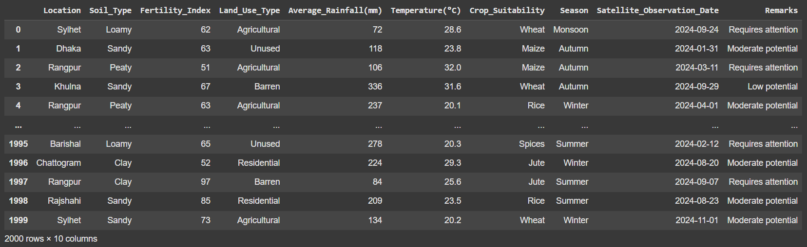
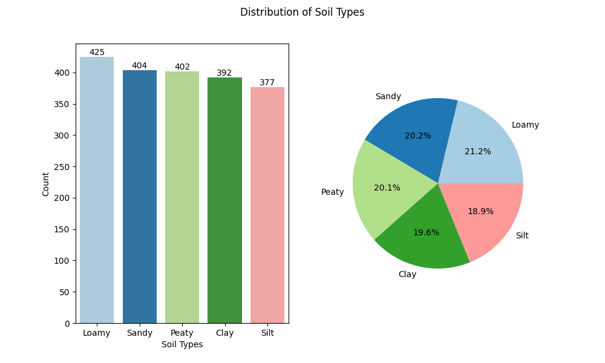
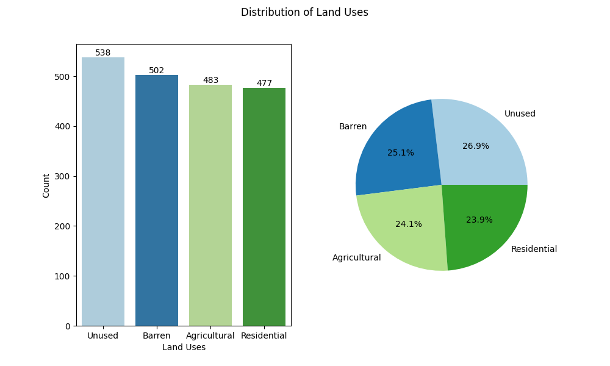
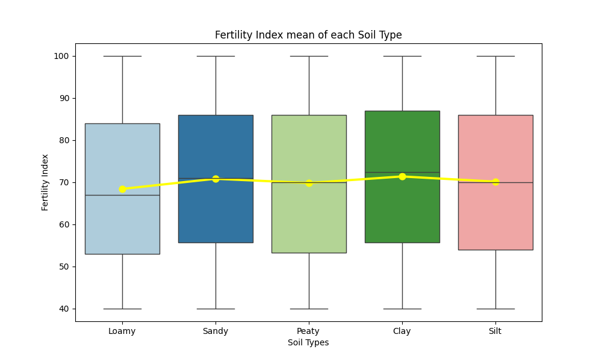
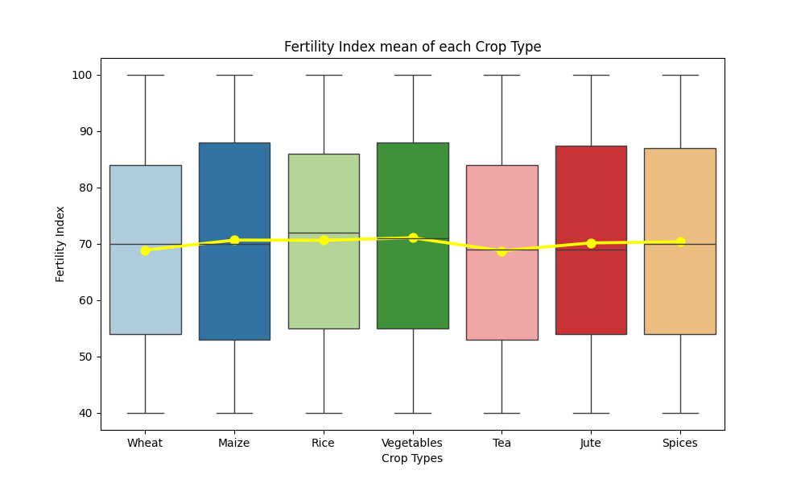
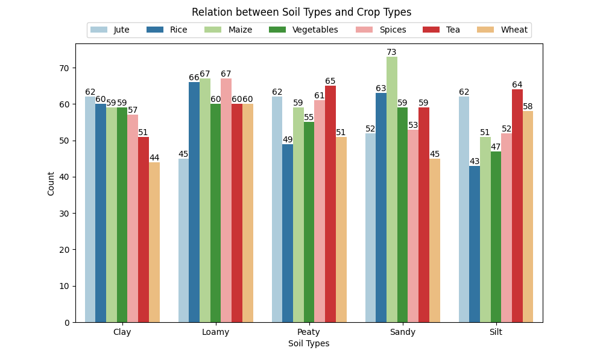
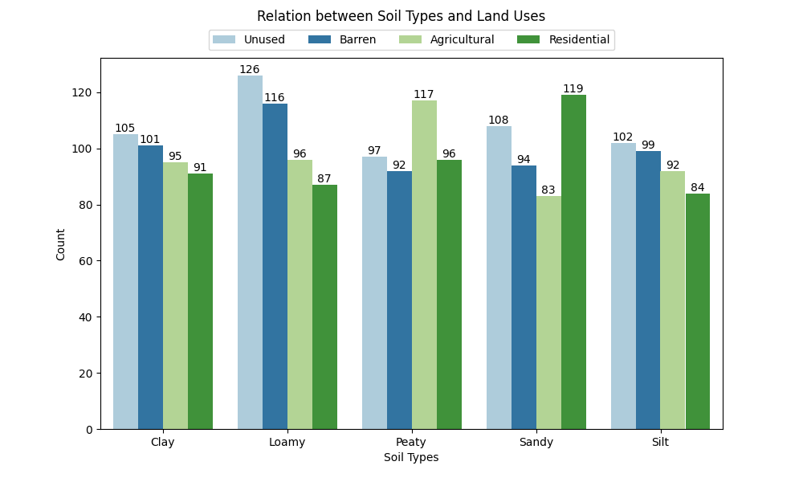
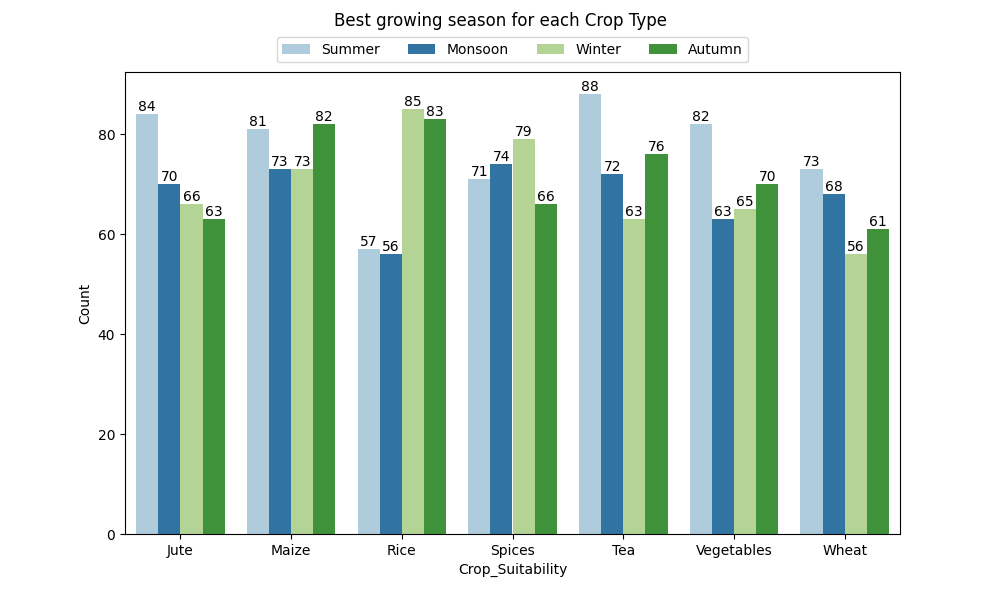
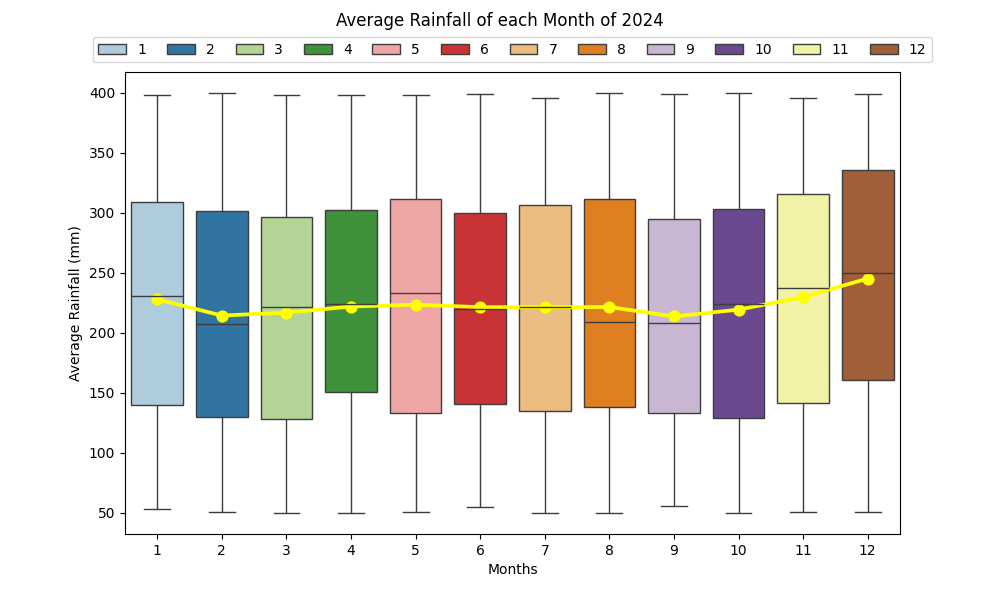
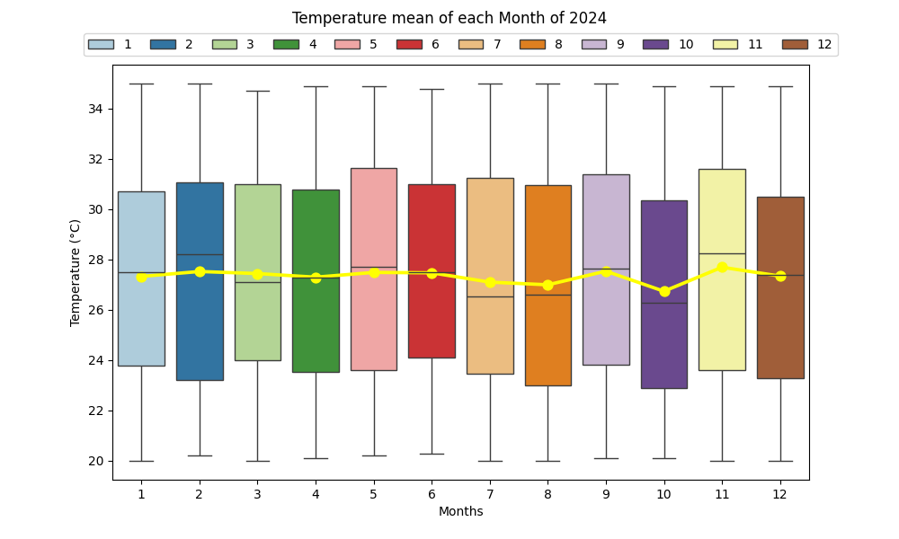

# Análise exploratória da relação entre propriedades do solo e aptidão agrícola em regiões de Bangladesh

## 💡 Objetivo do Projeto

* Realizar uma análise exploratória de dados (EDA) para observar a relação entre as propriedades do solo e a aptidão de terras agrícolas em regiões de Bangladesh no ano de 2024.

* Compreender as dinâmicas climáticas do país para auxiliar no desenvolvimento de estratégias sustentáveis que maximizem a produtividade agrícola e promovam a adaptação às mudanças climáticas.

## 🗺️ Bangladesh

* Está localizado no sul da Ásia, entre as coordenadas 20° 34′ N a 26° 38′ N de latitude e 88° 01′ E a 92° 41′ E de longitude. Possui um clima subtropical úmido, caracterizado por temperaturas moderadamente quentes, alta umidade e amplas variações de precipitação. 

* As mudanças climáticas globais representam riscos naturais significativos para as produções agrícolas e colheitas do país, afetando diretamente sua maior fonte de economia. O aumento das temperaturas, a intensificação de cheias e períodos de seca têm impactos severos sobre a agricultura, tornando essencial a realização de estudos que otimizem o uso da terra e melhorem o rendimento das colheitas.

## 📑 Dataset do Projeto

* O dataset utilizado, intitulado **“Agricultural Land Suitability and Soil Quality”**, foi publicado por Arif Miah na plataforma Kaggle, e está disponível para consulta no seguinte link: <a href="https://www.kaggle.com/datasets/arifmia/agricultural-land-suitability-and-soil-quality"> Agricultural Land Suitability and Soil Quality - Kaggle. </a>

## 📖 Dicionário das Variáveis

* **‘Location’** = A localização geográfica do terreno;
* **‘Soil_Type’** = Tipo de solo na área;
* **‘Fertility_Index’** = Pontuação de fertilidade que indica o potencial agrícola da terra;
* **‘Land_Use_Type’** = Uso atual da terra;
* **‘Average_Rainfall(mm)’** = Precipitação média anual em milímetros;
* **‘Temperature(ºC)’** = Temperatura média da região em Celsius;
* **‘Crop_Suitability’** = Tipo de cultivo adequado para o local;
* **‘Season’** = Época de cultivo preferida para a cultura;
* **‘Satellite_Observation_Date’** = A data da observação por satélite para o local.

## ❓ Perguntas que serão respondidas ao longo do projeto

* Qual o tipo de solo que mais aparece na base de dados?

* Qual o tipo de uso do solo que mais aparece na base de dados?
* Qual o tipo de cultura que mais aparece na base de dados?
* Qual a média do índice de fertilidade em cada tipo de solo?
* Qual a média do índice de fertilidade em cada tipo de cultura?
* Qual o tipo de cultura mais plantada em cada tipo de solo?
* Qual o tipo de uso do solo mais utilizado em cada tipo de solo?
* Qual a estação do ano preferida para cada tipo de cultura?
* Qual a relação entre as médias de precipitação e os meses do ano?
* Quais as temperaturas médias de cada um dos meses do ano?

## 1. Apresentando o conjunto de dados

### ❗️ Para a análise sobre a distribuição dos dados das variáveis categóricas (‘Soil_Type’, ‘Land_Use_Type’ e ‘Crop_Suitability’) foram utilizados dois métodos de visualização: um gráfico de barras para representar a quantidade absoluta e um gráfico de pizza para exibir as porcentagens relativas de cada categoria, dessa forma é possível compreender melhor o comportamento dos dados.

## 2. Distribuição dos tipos de solo

* Os resultados indicam que, embora haja uma leve variação entre as porcentagens, a distribuição dos diferentes tipos de solo é relativamente equilibrada, com diferenças pouco marcantes entre as categorias. 

* O tipo de solo mais frequente é o franco (Loamy), que representa 21.3% do total, com 425 ocorrências. Em contrapartida, o que menos aparece é o tipo siltoso (Silt), correspondendo a 18.9% dos dados, com 377 ocorrências.

* Os solos arenoso (Sandy) e orgânico (Peaty) apresentam uma distribuição bastante próxima, com 20.2% e 20.1% das ocorrências, respectivamente, totalizando 404 e 402 dados. O tipo de solo argiloso (Clay) possui 19.6% dos registros, correspondendo a 392 dados.

## 3. Distribuição dos tipos de uso do solo

* Os resultados indicam que, embora áreas não utilizadas sejam claramente mais frequentes, a distribuição entre os outros tipos de uso do solo é relativamente equilibrada.

* O uso do solo mais frequente é do tipo não utilizado (Unused), que corresponde a 26.9% do total, com 538 ocorrências. Enquanto o uso residencial (Residential) apresenta a menor frequência, correspondendo a 23.8% dos dados, com 477 ocorrências.

* As categorias de solo árido (Barren) e agrícola (Agricultural) possuem distribuições intermediárias e bastante próximas, representando, respectivamente, 25.1% e 24.2% dos dados, com 502 e 483 registros.

## 4. Distribuição dos tipos de cultura

* Os resultados mostram que, embora exista uma leve predominância do milho, a distribuição geral dos tipos de cultura é relativamente equilibrada.

* A cultura mais frequente no banco de dados é a do milho (Maize), que representa 15.4% do total, com 309 ocorrências. Enquanto a menos frequente é a do trigo (Wheat), que corresponde a 12.9%, com 258 registros.

* Outras culturas apresentam frequências intermediárias, como o chá (Tea), que aparece em 14.9% dos casos, com 299 ocorrências, e os temperos (Spices), que representam 14.5% dos dados, com 290 registros.

* As culturas de fibra (Jute), arroz (Rice) e vegetais (Vegetables) possuem distribuições bastante próximas, com 14.1%, 14.0%, e 14.0% dos dados, respectivamente, totalizando 283, 280, e 280 ocorrências.

### ❗️ Para a análise da relação entre os diferentes tipos de solo, cultura e o índice de fertilidade foram produzidos gráficos do tipo boxplot que permitiram a visualização da dispersão, dos valores extremos e das médias do índice para cada tipo de categoria das variáveis.

## 5. Relação entre os tipos de solo e o índice de fertilidade

* O índice de fertilidade é uma ferramenta essencial para avaliar a quantidade e a qualidade dos nutrientes presentes no solo. Solos com médias mais altas indicam um maior potencial agrícola. Esses resultados são fundamentais para otimizar a produção e garantir práticas de manejo mais eficientes. 

* Os resultados mostram que todos os tipos de solo apresentam o mesmo valor mínimo (40) e máximo (100) do índice de fertilidade, indicando uma amplitude uniforme entre as categorias. No entanto, as médias variaram ligeiramente entre os tipos de solo, o que não implica dizer que um solo seja significativamente mais fértil que o outro.

* O solo com a maior média de fertilidade foi o argiloso (Clay), com 71.4. Os solos arenoso (Sandy) e siltoso (Silt) têm médias próximas, com 70.8 e 70.2, respectivamente. E os solos orgânico (Peaty) e franco (Loamy) possuem os menores valores, com 69.8 e 68.4, respectivamente.

## 6. Relação entre os tipos de cultura e o índice de fertilidade

* O índice de fertilidade é fundamental para o sucesso no plantio das diferentes culturas, pois deve ser realizado em solos que atendam às necessidades nutricionais específicas de cada planta. Solos mais férteis favorecem o crescimento saudável e aumentam a produtividade, enquanto solos deficientes comprometem o desenvolvimento e reduzem os rendimentos.

* Assim como na análise anterior, os dados também possuem o mesmo valor mínimo (40) e máximo (100) do índice, indicando uma faixa de variação uniforme. As médias também não diferem tanto entre os tipos de cultura.

* A cultura de vegetais (Vegetables) apresenta a maior média, com 71.1. As culturas de milho (Maize) e arroz (Rice) possuem médias ligeiramente inferiores, ambas com 70.6. As culturas de fibra (Jute) e de temperos (Spices) apresentam médias muito próximas, com 70.2 e 70.3, respectivamente. Por outro lado, as culturas de trigo (Wheat) e de chá (Tea) possuem as menores médias do índice de fertilidade, com 68.9 e 68.8, respectivamente.

### ❗️ Para a análise da relação entre os diferentes tipos de solo com os tipos de cultura e de usos do solo foram produzidos gráficos de barra que permitiram a visualização da quantidade absoluta para cada tipo de categoria das variáveis.

## 7. Relação entre os tipos de solo e as culturas plantadas

* Essa análise permitiu identificar as culturas mais associadas a cada tipo de solo, bem como aquelas menos cultivadas. Esses resultados oferecem insights valiosos para o manejo agrícola, indicando quais combinações de solo e cultura podem ser feitas para otimizar e aumentar a produtividade.

* No solo argiloso (Clay), a cultura de fibras (Jute) foi a mais frequente, com 62 registros, enquanto as culturas de chá (Tea) e trigo (Wheat) apresentaram menor frequência, com 51 e 44 registros, respectivamente.

* O solo franco (Loamy) apresentou uma grande diversidade de culturas, com milho (Maize) e temperos (Spices) registrando 67 ocorrências cada, enquanto a cultura de fibras (Jute) teve a menor frequência, com apenas 45 registros.

* O solo orgânico (Peaty) teve maior frequência para o cultivo de chá (Tea), com 65 registros, enquanto a cultura de arroz (Rice) teve a menor presença, com 49 registros.

* No solo arenoso (Sandy), o milho (Maize) foi a cultura mais frequente, com 73 registros, enquanto o trigo (Wheat) teve a menor presença, com apenas 45 registros.

* No solo siltoso (Silt), a cultura de chá (Tea) foi a mais recorrente, com 64 registros, enquanto a cultura de arroz (Rice) teve a menor frequência, com 43 registros.

## 8. Relação entre os tipos de solo e os usos do solo

* Esta análise destacou a importância de entender como os diferentes tipos de solo, com suas características específicas, são mais adequados para determinadas atividades. Os resultados oferecem insights que auxiliam no aproveitamento sustentável do solo e na gestão eficiente dos recursos territoriais.

* O solo argiloso (Clay), possui uma predominância de áreas não utilizadas (Unused), com 105 registros, e uma menor frequência de uso residencial (Residential), com 91 registros.

* O solo franco (Loamy) também possui possui uma predominância de áreas não utilizadas (Unused), com 126 registros, e uma menor frequência de áreas residenciais (Residential), com 87 registros.

* No solo orgânico (Peaty), o uso mais frequente é o agrícola (Agricultural), com 117 registros, enquanto o menos comum é o solo árido (Barren), com 92 registros.

* O solo arenoso (Sandy) apresentou uma maior frequência de uso residencial (Residential), com 119 ocorrências. Enquanto o uso para agricultura obteve a menor quantidade de registros, com apenas 83.

* O solo siltoso (Silt) possui uma maior presença de áreas não utilizadas (Unused), com 102 registros, enquanto o uso menos frequente é o residencial (Residential), com 84 registros.

## 9. Estação do ano preferida para cada tipo de cultura

* Estudar sobre as estações do ano é essencial para otimizar a produtividade agrícola, garantindo que o plantio e a colheita ocorram nas condições climáticas ideais. Cada cultura possui um planejamento agrícola, com diferentes exigências de temperatura, umidade e luminosidade, e compreender esses fatores maximiza o rendimento e reduz os riscos de pragas e doenças. 

* A maioria das culturas analisadas apresentou o melhor desempenho durante o verão, incluindo fibras (Jute) com 84 registros, chá (Tea) com 88 registros, vegetais (Vegetables) com 82 registros, e trigo (Wheat) com 73 registros.

* O milho (Maize) teve seu melhor desempenho no verão (81 registros) e no outono (82 registros), enquanto o cultivo de arroz (Rice) teve um bom rendimento tanto no outono (83 registros), quanto no inverno (85 registros).

* A cultura do tempero (Spices) teve seu melhor desempenho principalmente no inverno, com 79 registros.

### ❗️Criação da variável "Month"

* Para as análises seguintes foi preciso criar uma nova variável que representa o mês do ano em que cada observação foi registrada, tomando como referência os meses informados na variável ‘Satellite_Observation_Date’.

## 10. Relação entre a precipitação média e os meses do ano

 * Estudar a distribuição da chuva ao longo do ano é fundamental para identificar os períodos com maior e menor disponibilidade de água, auxiliando no planejamento das épocas de plantio e nas estratégias de manejo hídrico.

* A análise entre os dados de precipitação e os meses do ano revelou variações interessantes na quantidade de chuva ao longo do ano, com valores que variam entre 50 mm e 400 mm.

* Os meses com a maior quantidade média de chuva são dezembro (245 mm), novembro (230 mm) e janeiro (228 mm). Enquanto que setembro (213 mm), fevereiro (214 mm) e março (216 mm) são os meses com a menor quantidade.

* Entre os meses de abril e agosto, a quantidade média de chuva variou apenas 2 mm, de 221 mm a 223 mm, indicando uma relativa estabilidade na precipitação durante esse período.

## 11. Relação entre as temperaturas e os meses do ano 

* Assim como a análise realizada entre os dados de temperatura e as estações do ano, essa análise revelou que as temperaturas em Bangladesh variam entre 20ºC e 35ºC com uma distribuição bastante constante ao longo dos meses. 

* A diferença entre as temperaturas registradas nos meses é pequena, variando apenas nas casas decimais, reforçando a ideia de que os dados do dataset utilizado no projeto sugerem uma estabilidade térmica ao longo do ano. 

* Os meses com a menor temperatura registrada são agosto e outubro, ambos com uma média de 26ºC, indicando uma leve diminuição nas temperaturas durante esses períodos, que podem ser influenciados por fatores climáticos sazonais. Em relação aos outros meses, as temperaturas não apresentam grandes variações, com uma média geral de 27ºC. 

## 🎯 Conclusão

* Os resultados obtidos neste projeto ajudaram a entender melhor as relações entre as propriedades do solo e as condições climáticas em Bangladesh.

* A análise dos solos revelou a predominância de cada tipo e seus diferentes potenciais agrícolas, indicando que cada um é mais adequado para diferentes tipos de cultivos. Esses dados são valiosos para planejar a alocação eficiente de culturas em áreas específicas.

* A análise das condições climáticas mostrou que, apesar das variações nos índices de precipitação entre os meses do ano, as temperaturas permanecem relativamente constantes. Essa estabilidade, em média de 27°C, é um fator positivo para a agricultura, enquanto as flutuações na precipitação destacam a necessidade de planejar bem o uso da água.

* Os insights gerados destacam a relevância de estudos como este, que combinam dados ambientais, climáticos e agrícolas, auxiliando o desenvolvimento de políticas públicas e incentivando uma agricultura mais sustentável.

## 🧪 Testes e Reprodutibilidade

* Para garantir a fidelidade na reprodução do projeto é preciso seguir algumas etapas fundamentais:

* Clone o repositório do projeto em sua máquina.

* Crie um ambiente virtual para isolar o projeto e evitar conflitos de dependências com outros projetos existentes.

* Instale todas as bibliotecas utilizadas no projeto, que estão listadas no arquivo **requeriments.txt**. Isso pode ser feito de forma simples utilizando o comando **pip install -r requirements.txt** no terminal.